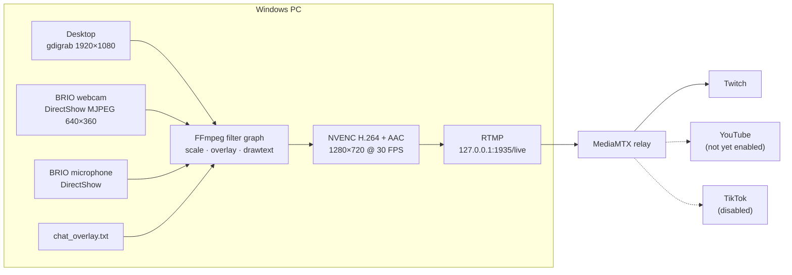
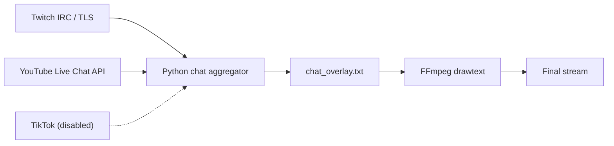

<div align="center">

# Multistream — Python + FFmpeg + MediaMTX

**Encode once on your Windows PC. Relay everywhere.**

A Windows live-streaming stack built on Python, FFmpeg, MediaMTX and NVIDIA NVENC — no OBS required.


</div>

---

## Overview

Ravaelv Multistream captures the desktop, a Logitech BRIO webcam and the BRIO microphone, composes them with a webcam overlay and broadcast graphics, encodes **one** H.264/AAC stream with NVENC, and publishes it over RTMP to a local [MediaMTX](https://mediamtx.org/) server. MediaMTX then relays that already-encoded stream to streaming platforms. A separate Python process aggregates Twitch and YouTube chat into an on-stream overlay.

> **Core idea:** encode one stream on the PC, then let MediaMTX relay the already-encoded stream to multiple platforms — no re-encoding per platform.

### Current status

| Capability | Status |
|---|---|
| Twitch streaming | ✅ Working |
| Twitch chat (IRC/TLS) | ✅ Working |
| Twitch OAuth validation and refresh | ✅ Working |
| YouTube chat | 🚧 Implemented in the aggregator; being enabled next |
| YouTube stream relay | ⏳ Not yet enabled |
| TikTok chat | ⏸️ Disabled |

---

## Table of Contents

- [Features](#features)
- [Architecture](#architecture)
- [Tested Environment](#tested-environment)
- [Quick Start](#quick-start)
- [Repository Structure](#repository-structure)
- [Requirements](#requirements)
- [Installation](#installation)
- [MediaMTX Configuration](#mediamtx-configuration)
- [Encoding Profile](#encoding-profile)
- [BRIO Webcam and Microphone](#brio-webcam-and-microphone)
- [Stream Graphics](#stream-graphics)
- [Unified Chat](#unified-chat)
- [Platform Setup](#platform-setup)
- [Configuration Reference](#configuration-reference)
- [Running the System](#running-the-system)
- [Performance and Realtime Targets](#performance-and-realtime-targets)
- [Troubleshooting](#troubleshooting)
- [Security](#security)
- [Design Principles](#design-principles)
- [Roadmap](#roadmap)
- [References](#references)
- [License](#license)

---

## Features

**Video**
- Full Windows desktop capture (`gdigrab`)
- Logitech BRIO 4K Stream Edition webcam + microphone (DirectShow)
- Webcam picture-in-picture overlay
- Custom broadcast graphics rendered inside FFmpeg
- NVIDIA NVENC H.264 hardware encoding, AAC audio
- Python-controlled FFmpeg pipeline, no OBS dependency

**Relay**
- Local RTMP ingest through MediaMTX
- MediaMTX stream forwarding to platform ingest servers

**Chat**
- Compact unified chat overlay (Twitch + YouTube, TikTok pluggable)
- Twitch chat over IRC/TLS
- YouTube Live Chat API support
- Twitch OAuth validation with refresh-capable token handling

---

## Architecture

### Video path



### Chat path



The chat process is deliberately separate from the video encoder: **a chat failure never stops the video stream.**

---

## Tested Environment

| Component | Tested value |
|---|---|
| Operating system | Windows 11 |
| Python | 3.14.x |
| FFmpeg | 9.0.1 |
| MediaMTX | v1.21.0 |
| Python wrapper | `ffmpeg-python` |
| GPU | NVIDIA GeForce GTX 1650 |
| Integrated GPU | Intel UHD Graphics 630 |
| Webcam | Logitech BRIO 4K Stream Edition |
| Desktop capture | `gdigrab` |
| Webcam capture | DirectShow / MJPEG |
| Final video | 1280×720 @ 30 FPS |
| Video codec | H.264 NVENC |
| Video bitrate | 4000 kbps CBR |
| Audio codec | AAC |
| Audio bitrate | 128 kbps |
| Audio sample rate | 48 kHz |
| GOP | 60 frames (2 seconds) |
| Local RTMP | `rtmp://127.0.0.1/live` |

> [!NOTE]
> This is the tested baseline, not a requirement that every installation use exactly these versions.

---

## Quick Start

Assumes Python, FFmpeg (with `h264_nvenc`) and MediaMTX are already installed. Full setup is in [Installation](#installation).

```powershell
# 1. Relay
cd C:\MediaMTX
.\mediamtx.exe
```

```powershell
# 2. Chat aggregator (new window)
cd C:\RTMPStreamer
.\.venv\Scripts\Activate.ps1
python chat_aggregator_auto_refresh.py
```

```powershell
# 3. Stream (new window)
cd C:\RTMPStreamer
.\.venv\Scripts\Activate.ps1
python MultistreamApp.py
```

---

## Repository Structure

Recommended GitHub layout:

```text
ravaelv-multistream/
├── README.md
├── LICENSE
├── SECURITY.md
├── .gitignore
├── requirements.txt
├── config/
│   └── chat_config.example.json
├── src/
│   ├── MultistreamApp.py
│   └── chat_aggregator_auto_refresh.py
└── docs/
    ├── ARCHITECTURE.md
    ├── SETUP.md
    ├── CHAT.md
    └── TROUBLESHOOTING.md
```

Local Windows runtime:

```text
C:\MediaMTX\
├── mediamtx.exe
└── mediamtx.yml

C:\RTMPStreamer\
├── .venv\
├── MultistreamApp.py
├── chat_aggregator_auto_refresh.py
├── chat_config.json          # private — never commit
├── chat_overlay.txt          # generated at runtime
└── requirements.txt
```

---

## Requirements

**Hardware**
- Windows 11 PC
- NVIDIA GPU with NVENC support (tested: GTX 1650)
- Webcam and microphone (tested: Logitech BRIO 4K Stream Edition)
- Stable network with sufficient upload capacity

**Software**
- Python
- FFmpeg (on `PATH`, with `h264_nvenc`)
- MediaMTX
- Python packages: `ffmpeg-python`, `requests`

---

## Installation

### 1. Python and virtual environment

Download Python from <https://www.python.org/downloads/windows/>, then verify:

```powershell
python --version
python -m pip --version
```

Create the project and a virtual environment:

```powershell
New-Item -ItemType Directory -Path C:\RTMPStreamer -Force
cd C:\RTMPStreamer
python -m venv .venv
.\.venv\Scripts\Activate.ps1
```

<details>
<summary>PowerShell blocks activation?</summary>

Use the `cmd` activation script instead:

```powershell
cmd /k C:\RTMPStreamer\.venv\Scripts\activate.bat
```

</details>

### 2. Python packages

```powershell
python -m pip install --upgrade pip
python -m pip install ffmpeg-python requests
python -m pip freeze > requirements.txt
```

> [!IMPORTANT]
> `ffmpeg-python` is only a Python wrapper. It does **not** install `ffmpeg.exe`.

### 3. FFmpeg

Install a Windows FFmpeg build and make sure it is on `PATH`:

```powershell
ffmpeg -version
where.exe ffmpeg
```

Tested version: `FFmpeg 9.0.1`.

### 4. Verify NVIDIA NVENC

```powershell
ffmpeg -hide_banner -encoders | findstr /i "h264_nvenc"
```

Expected output includes `h264_nvenc`. Without it, the production stream cannot use the intended hardware encoding path.

---

## MediaMTX Configuration

### Install

```powershell
New-Item -ItemType Directory -Path C:\MediaMTX -Force
```

Download MediaMTX from <https://github.com/bluenviron/mediamtx/releases> and place:

```text
C:\MediaMTX\mediamtx.exe
C:\MediaMTX\mediamtx.yml
```

Verify and validate (tested: `v1.21.0`):

```powershell
cd C:\MediaMTX
.\mediamtx.exe --version
.\mediamtx.exe --validate-conf=.\mediamtx.yml
```

Start:

```powershell
.\mediamtx.exe
```

Expected log lines:

```text
configuration loaded from C:\MediaMTX\mediamtx.yml
[RTMP] started with listener on :1935
```

### RTMP path

The production publisher uses `rtmp://127.0.0.1/live`. The path must accept a publisher:

```yaml
paths:
  live:
    source: publisher
```

Verify the listener:

```powershell
Test-NetConnection 127.0.0.1 -Port 1935
```

Expected: `TcpTestSucceeded : True`.

---

## Encoding Profile

The first implementation used `libx264`. The desktop + webcam + overlay pipeline measured **below realtime**, so production uses `h264_nvenc` on the GTX 1650.

| Setting | Value |
|---|---|
| Resolution | 1280×720 |
| Frame rate | 30 FPS |
| Codec | H.264 NVENC |
| Rate control | CBR |
| Bitrate | 4000 kbps |
| GOP | 60 frames (2 s) |
| B-frames | 0 |
| Pixel format | `yuv420p` |
| Audio | AAC, 128 kbps, 48 kHz |

Healthy target:

```text
fps ≈ 30    speed ≈ 1.00x    dup ≈ 0    drop ≈ 0
```

### Pipeline

```text
Desktop 1920×1080 ─┐
BRIO 640×360 MJPEG ┼─► FFmpeg filters
BRIO microphone ───┘        │
                            ├─ desktop  → 1280×720
                            ├─ webcam   → 320×180
                            ├─ webcam overlay
                            ├─ chat overlay
                            └─ broadcast graphics
                            │
                            ▼
                     1280×720 frame
                            │
                            ▼
              NVENC H.264 4000 kbps + AAC 128 kbps
                            │
                            ▼
                 RTMP /live  →  MediaMTX
```

---

## BRIO Webcam and Microphone

List devices:

```powershell
ffmpeg -list_devices true -f dshow -i dummy
```

Production devices:

| Role | Device name |
|---|---|
| Webcam | `BRIO 4K Stream Edition` |
| Microphone | `Microphone (BRIO 4K Stream Edition)` |

Check supported camera modes:

```powershell
ffmpeg -list_options true -f dshow -i video="BRIO 4K Stream Edition"
```

Production capture is **640×360 @ 30 FPS MJPEG**, scaled to **320×180** for the final picture-in-picture. A 320×180 overlay doesn't need 1080p or 4K capture, and the lower capture resolution reduces USB and decode pressure.

---

## Stream Graphics

All graphics are rendered inside the FFmpeg pipeline. OBS is not required.

| Position | Element |
|---|---|
| Top-left | `LIVE STREAM` / `Twitch.tv/Ravaelv` |
| Top-right | `● LIVE` |
| Left side | Compact unified chat panel |
| Bottom-right | BRIO webcam picture-in-picture |

---

## Unified Chat

The aggregator merges platform messages into one local feed:

```text
[T]  username: message
[YT] username: message
[TT] username: message
```

Messages are written to `C:\RTMPStreamer\chat_overlay.txt`, which FFmpeg reads with `drawtext`. This keeps chat independent of the video transport.

---

## Platform Setup

### Twitch

**Streaming** uses a stream key. The stream key is **not** the chat OAuth token. Conceptually, MediaMTX forwarding looks like:

```yaml
paths:
  live:
    source: publisher
    forward:
      - dest: rtmps://YOUR_TWITCH_INGEST/app#YOUR_TWITCH_STREAM_KEY
```

**Chat** uses Twitch IRC over TLS at `irc.chat.twitch.tv:6697` with the read-only scope `chat:read`. See the [Twitch IRC docs](https://dev.twitch.tv/docs/chat/irc).

**OAuth** — the aggregator:

1. validates the token;
2. connects to Twitch IRC;
3. periodically re-validates the token;
4. refreshes the token when a refresh-capable OAuth grant is available;
5. saves rotated refresh tokens back to the local configuration.

See [validating](https://dev.twitch.tv/docs/authentication/validate-tokens/) and [refreshing](https://dev.twitch.tv/docs/authentication/refresh-tokens/) tokens.

### YouTube

Chat uses the [YouTube Live Chat API](https://developers.google.com/youtube/v3/live/docs/liveChatMessages). The current implementation discovers the active live chat for a broadcast and collects its messages.

Google also offers [`liveChatMessages.streamList`](https://developers.google.com/youtube/v3/live/docs/liveChatMessages/streamList) for lower-latency server streaming. Moving the YouTube worker from polling to `streamList` is the next planned optimization.

### TikTok

TikTok chat is **disabled**. The project does not include an unverified general LIVE-chat connector.

A future connector can feed the same interface without touching the video pipeline:

```text
TikTok → add_message("TT", username, message) → chat_overlay.txt
```

---

## Configuration Reference

The public repository ships `config/chat_config.example.json`. Copy it to `C:\RTMPStreamer\chat_config.json` and fill in real values. **The real file must stay private.**

```json
{
    "twitch": {
        "enabled": true,
        "username": "YOUR_USERNAME",
        "client_id": "YOUR_TWITCH_CLIENT_ID",
        "client_secret": "YOUR_TWITCH_CLIENT_SECRET",
        "oauth_token": "YOUR_TWITCH_ACCESS_TOKEN",
        "refresh_token": "YOUR_TWITCH_REFRESH_TOKEN",
        "channel": "YOUR_USERNAME"
    },
    "youtube": {
        "enabled": false,
        "api_key": "YOUR_YOUTUBE_API_KEY",
        "video_id": "YOUR_YOUTUBE_LIVE_VIDEO_ID"
    },
    "tiktok": {
        "enabled": false,
        "username": "YOUR_USERNAME"
    }
}
```

| Key | Notes |
|---|---|
| `twitch.oauth_token` | A **User Access Token** with `chat:read`. Not the stream key. |
| `twitch.client_id` | Must match the Client ID the token was issued for. |
| `twitch.refresh_token` | Rotated automatically and saved back to this file. |
| `youtube.api_key` | Requires YouTube Data API v3 enabled on the key's project. |
| `youtube.video_id` | Video ID of a broadcast with an active live chat. Set `enabled` to `true` to activate. |
| `tiktok.enabled` | Currently `false`. |

---

## Running the System

Use three PowerShell windows.

**Window 1 — MediaMTX**

```powershell
cd C:\MediaMTX
.\mediamtx.exe
```

**Window 2 — Chat**

```powershell
cd C:\RTMPStreamer
.\.venv\Scripts\Activate.ps1
python chat_aggregator_auto_refresh.py
```

Expected:

```text
Twitch OAuth: ...
Twitch chat: authenticated.
Twitch chat: joined #ravaelv
Unified chat aggregator running.
```

**Window 3 — Stream**

```powershell
cd C:\RTMPStreamer
.\.venv\Scripts\Activate.ps1
python MultistreamApp.py
```

The stream publishes to `rtmp://127.0.0.1/live`.

---

## Performance and Realtime Targets

Watch the FFmpeg status line for `fps=`, `speed=`, `dup=` and `drop=`. A healthy stream approaches `fps=30`, `speed=1.00x`, `dup=0`, `drop=0`.

### `speed < 1.0x`

A value such as `speed=0.75x` means the pipeline is slower than realtime. Possible causes:

- CPU-heavy filters
- insufficient NVENC availability
- webcam capture pressure
- DirectShow buffering
- excessive webcam resolution
- excessive graphics processing
- other applications consuming GPU/CPU

### BRIO buffer overflow

If FFmpeg reports `real-time buffer ... too full` or `frame dropped`, the capture queue is filling. Current mitigation: capture the BRIO at **640×360 MJPEG** and overlay at **320×180** instead of 1080p/4K.

---

## Troubleshooting

<details>
<summary><code>path 'live' is not configured</code></summary>

MediaMTX started with the wrong configuration. Run it from `C:\MediaMTX` and confirm the log shows:

```text
configuration loaded from C:\MediaMTX\mediamtx.yml
```

</details>

<details>
<summary><code>Cannot open connection tcp://127.0.0.1:1935</code></summary>

MediaMTX is stopped or not listening. Check:

```powershell
Test-NetConnection 127.0.0.1 -Port 1935
```

</details>

<details>
<summary><code>Unrecognized option 'input_format'</code></summary>

Use the parameters supported by the installed FFmpeg build. For BRIO MJPEG capture this project uses:

```python
vcodec="mjpeg"       # correct
input_format="mjpeg" # not supported here
```

</details>

<details>
<summary><code>video_size</code> becomes <code>1x9</code> or <code>1x2</code></summary>

With `ffmpeg-python`, pass tuples, not strings:

```python
video_size=(1920, 1080)    # correct
video_size="1920x1080"     # wrong
```

</details>

<details>
<summary>Twitch chat authentication failure</summary>

Verify that:

- `oauth_token` is a User Access Token;
- it is not the Twitch stream key;
- the token belongs to the `ravaelv` account;
- `chat:read` is granted;
- the token's Client ID matches the configured Client ID.

</details>

<details>
<summary>YouTube HTTP 400</summary>

Check that:

- YouTube Data API v3 is enabled;
- the API key is valid;
- the live video ID is correct;
- the broadcast actually has an active live chat.

</details>

---

## Security

Never commit:

```text
chat_config.json
.env
*.token
*.secret
*.key
```

Treat all of these as credentials:

- Twitch stream key
- Twitch OAuth access token
- Twitch refresh token
- Twitch Client Secret
- YouTube API key

> [!WARNING]
> A MediaMTX `forward` destination embeds your stream key. Keep `mediamtx.yml` out of version control if it contains one.

If a credential is exposed, revoke or rotate it immediately.

<details>
<summary>Recommended <code>.gitignore</code></summary>

```gitignore
# Python
.venv/
__pycache__/
*.py[cod]

# Runtime
logs/
chat_overlay.txt

# Secrets
chat_config.json
.env
*.token
*.secret
*.key

# Media
*.mp4
*.mkv
*.flv
*.ts

# IDE / OS
.vscode/
.idea/
.DS_Store
Thumbs.db
```

</details>

---

## Design Principles

The system is split into independent layers.

```text
Video:  Capture → FFmpeg filters → NVENC → RTMP → MediaMTX
Chat:   Platform → Python parser → local queue → chat_overlay.txt → FFmpeg
```

This means:

- chat problems don't kill video;
- platform chat credentials never live in the encoder;
- the encoder doesn't need to know how any platform's chat API works;
- new platforms plug in through the same `add_message()` interface.

---

## Roadmap

**Completed**

- [x] Windows environment and Python project
- [x] FFmpeg integration
- [x] MediaMTX RTMP ingest
- [x] Full desktop capture
- [x] BRIO webcam and microphone
- [x] Webcam picture-in-picture
- [x] Stream banners
- [x] Compact chat overlay
- [x] NVIDIA NVENC H.264
- [x] Twitch stream forwarding
- [x] Twitch chat
- [x] Twitch OAuth validation and refresh-capable architecture

**Next**

- [ ] Enable YouTube chat
- [ ] Move YouTube chat from polling to `liveChatMessages.streamList`
- [ ] Relay the stream to additional platforms through MediaMTX
- [ ] TikTok chat connector via `add_message()`

---

## References

| Topic | Link |
|---|---|
| MediaMTX | <https://mediamtx.org/> · [Forwarding](https://mediamtx.org/docs/features/forward) |
| FFmpeg | <https://ffmpeg.org/> |
| Python | <https://www.python.org/> |
| Twitch authentication | <https://dev.twitch.tv/docs/authentication/> |
| Twitch IRC chat | <https://dev.twitch.tv/docs/chat/irc> |
| Twitch token validation | <https://dev.twitch.tv/docs/authentication/validate-tokens/> |
| Twitch token refresh | <https://dev.twitch.tv/docs/authentication/refresh-tokens/> |
| YouTube live chat | <https://developers.google.com/youtube/v3/live/docs/liveChatMessages> |
| YouTube low-latency chat | <https://developers.google.com/youtube/v3/live/docs/liveChatMessages/streamList> |

---

## License

No license has been chosen yet. Add a `LICENSE` file before distributing the repository for public reuse; without one, all rights are reserved by default.
